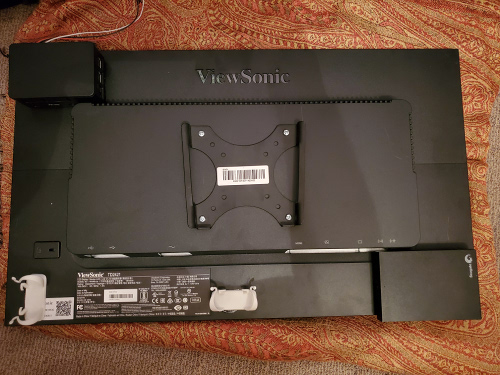
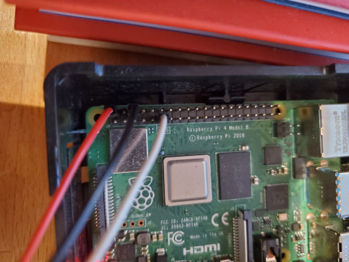
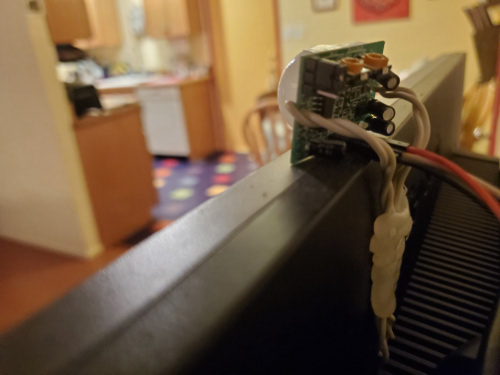
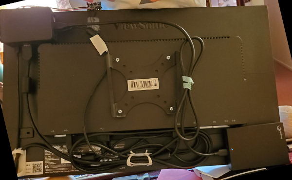

## A touchscreen digital media frame whose name is an homage to [PiPresents](https://pipresents.wordpress.com/)

I couldn't find a digital media frame that did all the things I wanted, so I made my own. This software is made for a touchscreen to do the following:

* Show both images and video
* Have sound for the video
* Have the tracks be shuffled in a random order
* Be able to annotate the images and videos with text
* Be able to navigate through the tracks using the touchscreen
* Use the touchscreen to be able to unmute and mute videos
* Have a motion sensor so that the software pauses and turns the monitor off when there has been no motion for a set amount of time, and then unpauses and turns on monitor when there is motion
* Be able to handle thousands of images and video
* Have all the hardware fit on the back of the monitor
* Be able to mount the monitor to the wall
* Use a full size monitor
* No soldering

Currently, this software only works on the Pi3 running Raspbian. Below are instructions on how to assemble the hardware (i.e., monitor, Pi, motion sensor, external hard drive) as well as how to set up and run the software.

## Build Instructions

**1\.** First you will need to get the following:

* [Raspberry Pi 3 Model B+](https://www.raspberrypi.org/products/raspberry-pi-3-model-b-plus/)
* [Pi 3 B+ tall case](https://www.pishop.us/product/highpi-raspberry-pi-b23-case-black/)
* [Micro SD card with NOOBS](https://www.amazon.com/Raspberry-Pi-32GB-Preloaded-NOOBS/dp/B01LXR6EOA)
* [Touchscreen monitor](https://www.amazon.com/ViewSonic-TD2421-Dual-Point-Optical-Monitor/dp/B01KEEMS1U/)
* [Low profile VESA wall mount](https://www.amazon.com/Rosewill-Computer-Mounting-Patterns-RMS-MF2720/dp/B00558ORME)
* [External Hard Drive](https://www.amazon.com/Seagate-Backup-External-Drive-Portable/dp/B07MY4KWFK)
* [3ft USB cable for hard drive](https://www.amazon.com/gp/product/B00P0C4M7A)
* [Micro-USB power supply](https://www.pishop.us/product/wall-adapter-power-supply-micro-usb-2-4a-5-25v/)
* [PIR Motion Sensor](https://www.pishop.us/product/hc-sr501-pyroelectric-infrared-pir-motion-sensor-detector-module/)
* [Female-to-Female jumper cables](https://www.pishop.us/product/female-to-female-jumper-cable-x-40-20cm/)
* [Velcro strips](https://www.amazon.com/gp/product/B00006IC2T)
* Cord Clips
* Thin, semi-flexible, rubber-coated wire

**2\.** Put the Pi into the case and then insert the SD card (don't insert the SD card first!). Add velcro strips to the bottom of the case and matching strips on the back of the monitor. Do the same for the hard drive. They should be positioned like this:

I have also epoxied cord clips onto the back to hold the bundle of cords that will be there.

**3\.** Before you put the cover on the Pi case, you need to attach the jumper cables for the PIR. I used black for ground (GND), white for signal (OUT), and red for power (+5V). I attached the power to pin 2, the ground to pin 6, and the signal to pin 11 (GPIO17), like so:

Yes, I know this is a picture of a Pi4, but the pinout is the same.

**4\.** Put the cover on the case. Attach the jumper cables to the PIR. Right below the pins on the PIR are the labels for GND, OUT, and +5V. Also, you can set the orange dials on the PIR... set the time to minimum, and set the sensitivity to somewhere in the middle. You will have to play with that dial to get the right position for the sensitivity you want after you place the frame where it will go. Now, we will glue the PIR motion sensor to the monitor. I used some thin, rubber-coated wire to mount the sensor so that it peeks above the top of the monitor and used a hot glue gun to glue the wires to the back of the monitor:

**5\.** Now attach all the other cables and use the cord clips to hold the cords. Attach the HDMI cable to the Pi and monitor. Attach the power supply to the Pi. Attach the USB cable from the monitor to the Pi (for the touchscreen mouse emulation). Attach the external hard drive to the Pi using the 3ft cable. After that is all done, it should look like this (minus the VESA mount):

You want to make sure you can remove and stick on the hard drive relatively easily. This is so that you can remove the hard drive to copy files over (from your main computer) whenever you have new pictures and videos. In my experience, copying over wireless is very slow, but maybe it will be different for you based on your setup.

**6\.** Now we need to boot the Pi and install the software. Attach a keyboard and mouse to the Pi and boot it up. You may need to do some setup before it boots you into a desktop. You'll want a full install of Raspbian with a desktop. Once you are at the desktop, open a terminal and run the following:

    sudo apt-get update
    sudo apt-get upgrade
    sudo apt-get install python3-pexpect
    sudo apt-get install python3-pil.imagetk
    sudo apt-get install dbus
    sudo pip3 install evdev

**7\.** Next we need to download and install pngview. pngview is part of the [raspidmx repository](https://github.com/AndrewFromMelbourne/raspidmx). After cloning the repo, you only need to make pngview. Finally, copy pngview to /usr/bin.

    git clone https://github.com/AndrewFromMelbourne/raspidmx.git
    cd raspidmx/pngview
    make
    sudo cp pngview /usr/bin

**8\.** Now we clone the nik-presents repo:

    cd /home/pi
    git clone https://github.com/najoshi/nik-presents.git

Find the directory that your external hard drive mounted to. Mine is "/media/pi/Seagate\ Expansion\ Drive", but yours may be different. Create a directory called "media" on the drive. This is where your pictures and videos will be kept. See below for instructions on how to structure the directories, convert the media so that it can be shown on the monitor, choose the media you want, and create a JSON file for the tracks. Once you have your media and JSON file, update the "nikwrapper.sh" script to reflect those. The "--mediadir" option only needs the path up to your "media" directory. I.e., my media directory is "/media/pi/Seagate\ Expansion\ Drive/media", but the directory for the "--mediadir" option is "/media/pi/Seagate\ Expansion\ Drive". nik-presents has the following options:

    usage: nik_presents_pi3.py [-h] --jsonfile JSONFILE --mediadir MEDIADIR
                           [--timeout TIMEOUT] [--duration DURATION]
                           [--verbose]

    optional arguments:
      -h, --help           show this help message and exit
      --jsonfile JSONFILE  JSON file with tracks.
      --mediadir MEDIADIR  Root directory for media.
      --timeout TIMEOUT    Number of seconds for PIR timeout (Default 120).
      --duration DURATION  Number of seconds images are shown (Default 8).
      --verbose            Informational output to STDOUT.

You can change the PIR timeout and the image duration to whatever suits you. Just add those options to the "nikwrapper.sh" file.

**9\.** The final step is to make nik-presents automatically start on boot and to hide the mouse cursor. Make sure to test out nik-presents on the command-line using your media files before doing this step (See below). Open the Raspberry Pi Configuration editor and under "Display", disable screen blanking. Go to the "/home/pi/.config/lxsession/LXDE-pi/" directory. If it does not exist, create it.

    cd /home/pi/.config/lxsession/LXDE-pi/

In this directory, there should be a file called "autostart". If it doesn't exist, create it. Change the file so the contents look like this:

> @lxpanel --profile LXDE-pi
>
> @pcmanfm --desktop --profile LXDE-pi
>
> @xscreensaver -no-splash
> 
> /home/pi/nik-presents/nikwrapper.sh

Finally, edit the "/etc/lightdm/lightdm.conf" file:

    sudo nano /etc/lightdm/lightdm.conf

There is a section (mine is under where it has [Seat:\*]) where you can specify the xserver-command. Uncomment that line and change it to this:

> xserver-command=X -nocursor

Now reboot your Pi. It should log into the desktop and then after about 10 seconds nik-presents should start up.

**10\.** nik-presents shows the tracks in shuffled order. When your media frame is running, you will be able to navigate through the tracks using your touchscreen. The first third of the screen, going from left to right, is the "previous" button, i.e. go to the previous track. The middle third is "pause". The last third is "next". If the track is a video, then the top right corner of the screen becomes an unmute/mute button. Videos always start muted, so you can touch the top right corner to unmute if you want to hear the sound and then touch it again to mute. The volume is determined by the setting on your monitor. nik-presents will pause and turn off the monitor after a stretch of no motion (default 120 seconds, can be set by the user). When motion is detected, the monitor turns on and nik-presents unpauses.

## Media (Pictures & Videos) conversion and configuration instructions

**1\.** In order to use nik-presents, you will need to resize your images to fit in the 1920x1080 screen. Videos generally do not need to be converted, however, if the frame rate for your video is non-standard (e.g. 60fps) then there might be some issues with the subtitles, which are used for annotation. In order to make this easier on myself, I have written a series of perl scripts to help. These scripts were written for use on the command-line of a linux desktop, but they may work for Macs as wella. Also, since I use the [Thunar file manager](https://docs.xfce.org/xfce/thunar/start), to make it even easier for myself I have used the "configure custom actions" feature of Thunar to add the scripts as custom actions. Then I can choose the directories using the mouse and then right click and run the action I want on those directories. My workflow for new media is to make a copy from the originals, convert, annotate, and choose the ones I want to display. I do this on my main Linux desktop (Ubuntu) and then copy them over to the external hard drive. You may need to install the following perl modules on your main desktop to use the scripts:

* Tk
* Cpanel::JSON::XS
* Image::ExifTool

**2\.** The first step is to make a copy of the directory (so that we don't touch the originals), but with links to videos instead of copies to save on space. However, before you do that you may want to use the "reorder_by_time.pl" script. This will take a directory of files and prepend numbers to the filenames so that they are in chronological order by time that the picture/video was taken. This makes it easier to do the annotation for directories where there are media from different sources, i.e. from cameras, phones, etc. My directory structure is very simple. I keep the originals in the Pictures folder, where I create directories for each trip. In each directory are all the files from the trip, no sub-directories. The directory names are typically the trip followed by the month and year. An example trip directory name would be "Autumn Lights Festival in Oakland - October 2019". Once you are ready to copy over the directory, you can use the "copydir.pl" script. You will want to edit the "mediadir" variable in the script to point to your "media" directory. This is the directory that will eventually be copied to your external hard drive. This script will copy the directory, but it will link to videos to save space.

**3\.** The next step is to transform the media to work with the monitor. This is primarily just resizing and rotating the images. In the scripts directory, there are two files, "transform_media.pl" and "transform_wrapper.pl". These are used to do the transforming of the copied directories. transform_wrapper.pl will take multiple directories as input and run transform_media.pl on each in a terminal so you can see any output and errors. I have noticed that for panoramic shots, it gives me warnings but doesn't seem to affect the conversion of the image. It will rename images with a "resized" at the end of the filename.

**4\.** Now we need to choose the media we want to display and annotate them. nik-presents will automatically use the directory name as part of the annotation, but you can also add more detailed annotation for each image/video. The annotation is text that is shown either next to the image or as subtitles on a video. This allows you to know where and when the picture/video was taken as well as any more details you want to know. The subtitles will basically just be static for the whole video except for the elapsed time.
